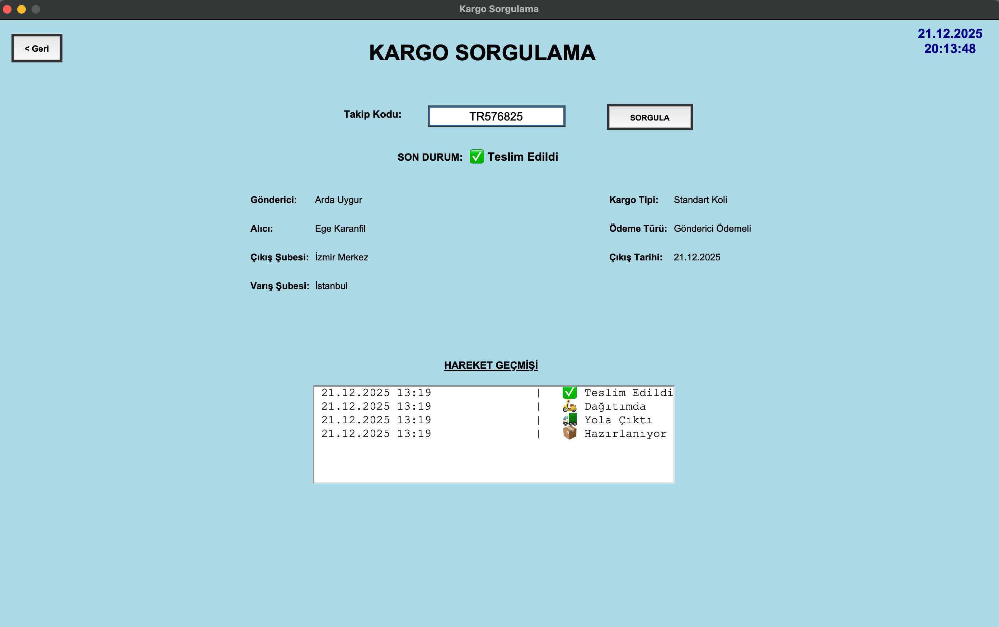
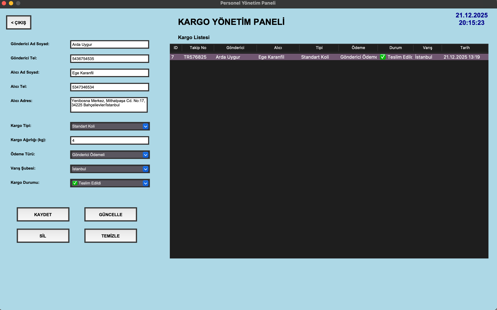

# Python & MySQL Kargo Takip ve Yönetim Sistemi

## 📌 Proje Özeti
Kargo şirketlerinin günlük operasyonlarını dijitalleştirmek ve müşterilere anlık kargo takip imkanı sunmak amacıyla geliştirilmiş masaüstü uygulamasıdır. Proje, müşteri ve personel olarak iki farklı arayüze sahiptir.

## 🚀 Kullanılan Teknolojiler
* **Programlama Dili:** Python 3
* **Arayüz (GUI):** Tkinter (Toplevel modülü ile çoklu pencere yönetimi)
* **Veri Tabanı:** MySQL
* **Kütüphaneler:** `mysql.connector`, `time`, `random`, `ttk`

## ⚙️ Temel Özellikler
* Müşteriler için giriş yapmadan, doğrudan takip kodu ile anlık kargo sorgulama ekranı.
* Personeller için güvenli giriş ekranı ve veri tabanına yeni personel kayıt imkanı.
* Personel paneli üzerinden kargolar için CRUD işlemleri.
* Kargo eklendiğinde `random` kütüphanesiyle otomatik ve benzersiz "TR" uzantılı takip kodu üretimi.

## 🛠️ Veri tabanı Mimarisi ve Zorlukların Çözümü (Loglama)
Projedeki en kritik nokta, kargoların durum değişikliklerinin tarihçeli olarak (log) tutulmasıydı.
* **Çözüm:** Veri tabanında `kargolar` tablosunun yanına ayrı bir `kargo_tarihce` tablosu oluşturuldu ve `kargo_id` üzerinden Foreign Key ile bağlandı.
* **ID Yakalama:** Kargo ilk eklendiğinde ID'si henüz belli olmadığı için tarihçeye kayıt atılamıyordu. Bu sorun Python'daki `cursor.lastrowid` metodu ile veritabanının o an ürettiği son ID yakalanarak çözüldü ve loglama işlemi başarıyla tamamlandı.

## 📸 Ekran Görüntüleri

### Kargo Sorgulama ve Hareket Geçmişi

### Kargo Yönetim Paneli (CRUD Operasyonları)

## 🤝 Katkıda Bulunanlar
Bu proje iki kişilik bir ekip çalışmasıyla geliştirilmiştir:
* **Arda Uygur:** Python kodlaması, backend mantığı ve MySQL veri tabanı entegrasyonu.
* **Mehmet Ali Ege Karanfil:** Tkinter arayüz (GUI) tasarımı ve SQL tablo yapılarının oluşturulması.
